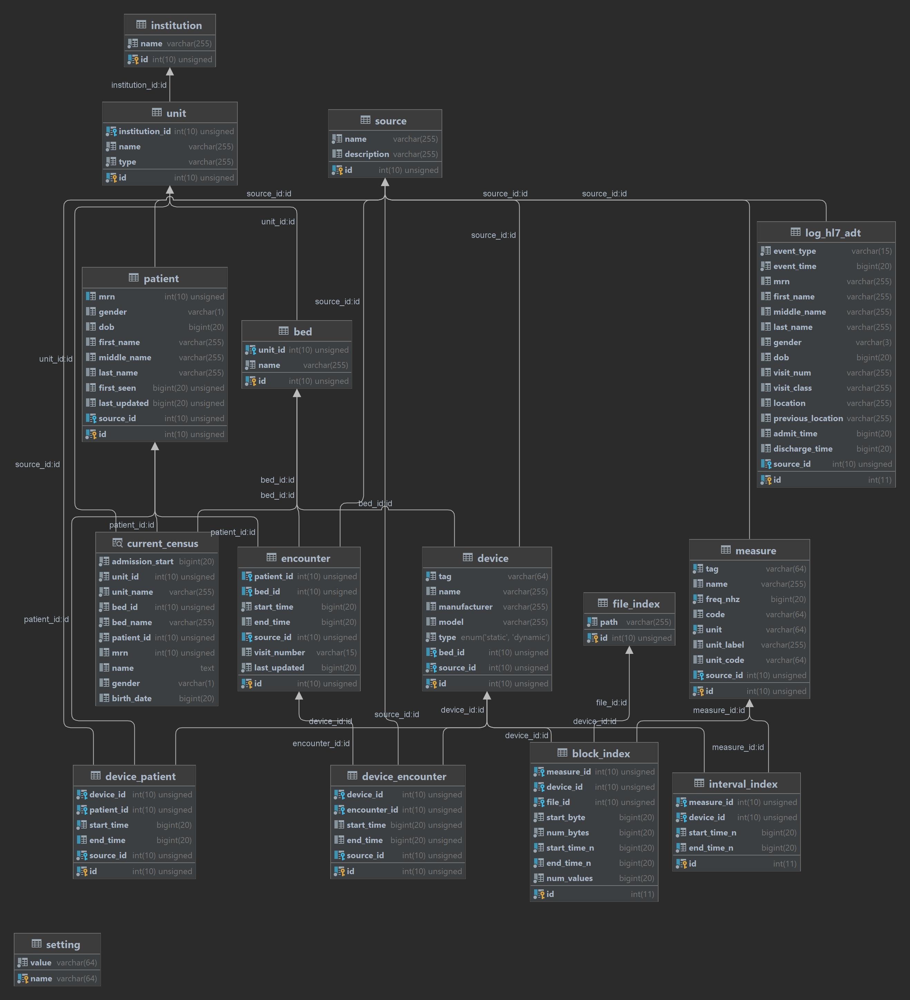

# AtriumDB
For more detailed documentation click [here](https://atriumdb.sickkids.ca/docs/).

## Installation

To install the base version of AtriumDB run:

```console
$ pip install atriumdb
```

### Compile from source
Clone the GitHub repository
```console
$ git clone https://github.com/LaussenLabs/atriumdb
```
#### Atriumdb SDK C Library
The instructions to build the C code on Linux are contained in two shell scripts in the repo tsc-lib/build_debug.sh and tsc-lib/build_release.sh.
Once the two binaries are built they should be placed in a folder called bin in the sdk folder. 
However, it is recommended that you build the binaries using the provided Docker build container as it is a consistent build environment and contains all the necessary packages.

##### Docker
If you build using docker (recommended) it will cross compile both for Linux and Windows.
First you build the docker image from the Dockerfile in the tsc-lib folder using the command:
```shell
$ docker build -t c-build .
```
Then to build the docker container and the binaries for release you use the command:
```shell
$ docker run --name c-build-release -v /path/to/repo:/adb-lib-sdk -w /adb-lib-sdk/tsc-lib --init  -it c-build ./build_release.sh
```
If you want to build the binaries in debug mode use the command:
```shell
$ docker run --name c-build-debug -v /path/to/repo:/adb-lib-sdk -w /adb-lib-sdk/tsc-lib --init  -it c-build ./build_debug.sh
```
These commands will automatically place the built binaries in the proper folder in the SDK. 
If you need to rebuild the binaries all you need to do is restart the container.

#### Python SDK
Once you have the binaries built, make sure that you have python build installed and you are in the sdk folder of the repo.
Then run the below commands to build the python wheel file. Once built you can pip install it. 
```console
$ pip install build
$ cd sdk
$ python -m build
```

## Metadata Database Schema



