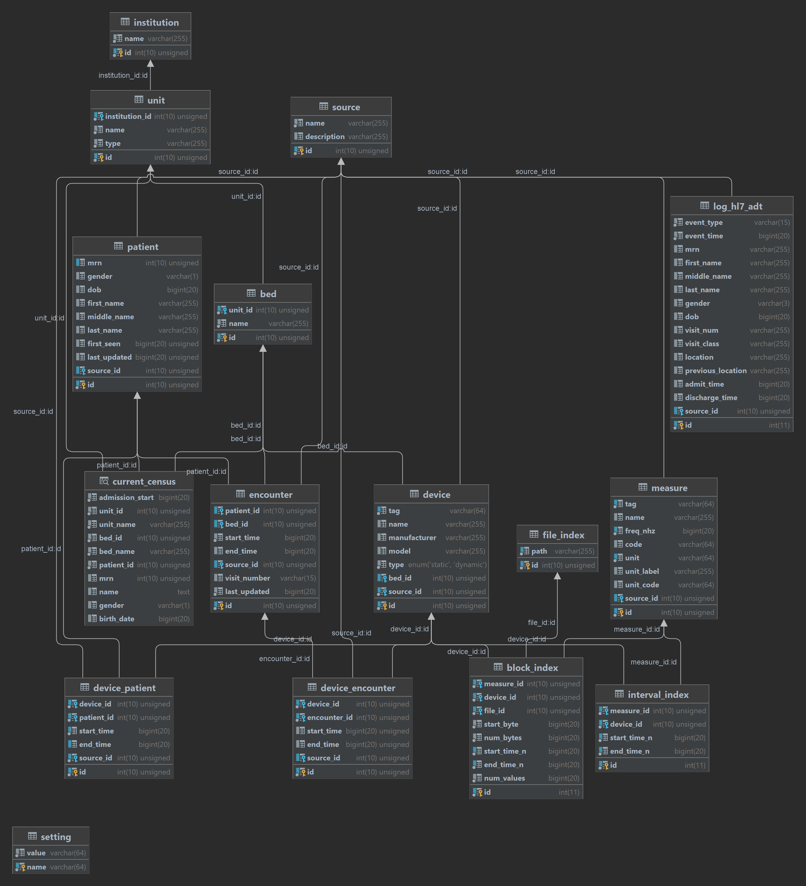

# AtriumDB
For more detailed documentation click [here](https://docs.atriumdb.io/).

## Installation

To install the base version of AtriumDB run:

```shell
$ pip install atriumdb
```

### Compile from source
Clone the GitHub repository and change into its directory
```shell
$ git clone https://github.com/LaussenLabs/atriumdb
```
Building the package compiles the C library in `sdk/tsc-lib` with CMake. It needs a C compiler, lz4, zstd and an OpenMP runtime:
- Debian/Ubuntu: `sudo apt install build-essential liblz4-dev libzstd-dev`
- RHEL/Rocky: `sudo dnf install gcc lz4-devel libzstd-devel`
- macOS: `brew install libomp lz4 zstd`

#### Python SDK
Install the package from the sdk folder of the repo, or build a wheel from it.
```shell
$ cd atriumdb/sdk
$ pip install .
$ pip install -e .   # editable install for development
$ pip install build && python -m build
```

#### Atriumdb SDK C Library
From the repository root, the C library can be built on its own with CMake 3.15 or newer and placed in `sdk/atriumdb/bin`, where the SDK loads it from a source checkout.
```shell
$ cmake -S sdk/tsc-lib -B build
$ cmake --build build
$ cmake --install build --prefix sdk
```
On macOS `sdk/tsc-lib/build_mac.sh` does the same.

##### Docker
The Docker build container cross compiles the library for both Linux and Windows.
First you build the docker image from the Dockerfile in the sdk/tsc-lib folder using the command:
```shell
$ docker build -t c-build sdk/tsc-lib
```
To build the docker container and the binaries for release you need edit the command below by changing "/path/to/atriumdb" to the path to the repository on your computer.
Then run the command:
```shell
$ docker run --name c-build-release -v /path/to/atriumdb:/atriumdb --init -it c-build ./build_release.sh
```
If you want to build the binaries in debug mode use the command:
```shell
$ docker run --name c-build-debug -v /path/to/atriumdb:/atriumdb --init -it c-build ./build_debug.sh
```
NOTES:
- These commands will automatically place the built binaries in the proper folder in the SDK
- If you need to rebuild the binaries all you need to do is restart the container
- If you would rather run the build commands yourself inside the container just remove the ./build_release.sh from the end of the docker run command and it will give you a shell for the container

## Metadata Database Schema



