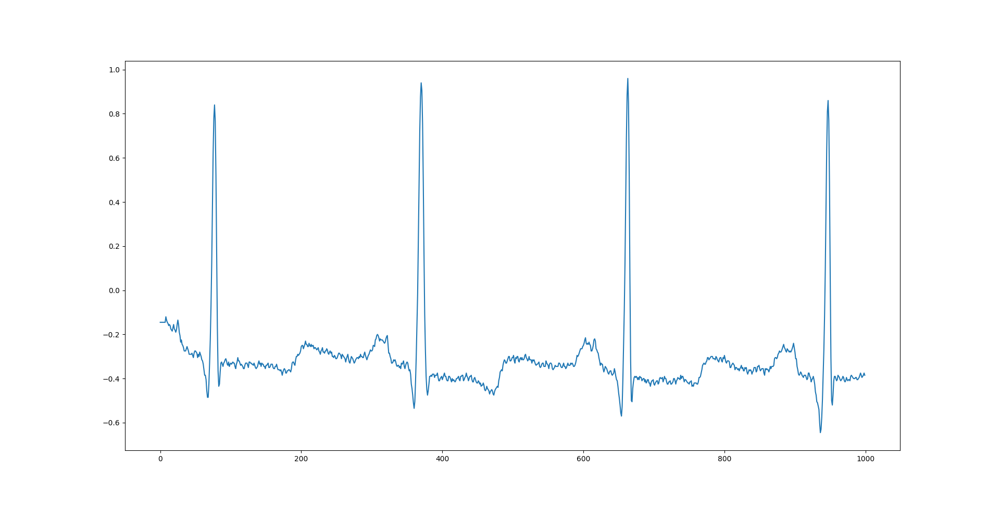

################################################################################
Tutorials
################################################################################

***************************************
Standard Data Access
***************************************

In this tutorial, we will walk you through the process of creating a dataset, inserting new data, and querying that
data using the atriumdb library. In this example we will pull data from the MIT-BIH Arrhythmia Database and store it in our dataset.

Prerequisites
-------------

- Python 3.8 or higher
- atriumdb library
- wfdb library
- matplotlib library
- tqdm library

You can install the required libraries using pip:

.. code-block:: bash

   pip install atriumdb wfdb tqdm matplotlib

Creating a New Dataset
----------------------

First, let's create a new dataset using the atriumdb library. We will use the default SQLite metadata database for simplicity.
The :ref:`create_dataset <create_dataset_label>` method asks you to specify:

- `dataset_location`: The local directory where the binary files will be written.
- `database_type`: What type of supporting database technology to use (sqlite is the default, mariadb, mysql).
- `connection_params`: If using mariadb or mysql, connection parameters described below used to connect to the database.

.. code-block:: python

   from atriumdb import AtriumSDK

   sdk = AtriumSDK.create_dataset(dataset_location="./new_dataset")

You can also create a dataset with a different metadata database, such as MariaDB or MySQL, by providing the
`database_type` and `connection_params` parameters. For example:

.. code-block:: python

   connection_params = {
       'host': "localhost",
       'user': "user",
       'password': "pass",
       'database': "new_dataset",
       'port': 3306
   }
   sdk = AtriumSDK.create_dataset(dataset_location="./new_dataset", database_type="mysql", connection_params=connection_params)

Additionally, you can set the protection mode and overwrite behavior using the `protected_mode` and `overwrite` parameters.
For example, to create a dataset with protection mode enabled and an overwrite behavior set to "ignore":

.. code-block:: python

   sdk = AtriumSDK.create_dataset(dataset_location="./new_dataset", protected_mode=True, overwrite="error")

Protected mode disables any data deletion operations.

Overwrite determines what happens when multiple values are stored for the same signal from the same source at the same time.
Allowed values are:

- `"error"`: an error will be raised.
- `"ignore"`: the new data will not be inserted.
- `"overwrite"`: the old data will be overwritten with the new data.

The default behavior can be changed in the `sdk/atriumdb/helpers/config.toml` file.

Inserting Data into the Dataset
--------------------------------

Now that we have created a new dataset, let's insert some data into it. Below, we read data
from the MIT-BIH Arrhythmia Database and store it in our dataset. In this example, we will create a separate device
for each record and handle multiple signals in a single record.

.. code-block:: python

    import wfdb
    from tqdm import tqdm
    import numpy as np

    # Get the list of record names from the MIT-BIH Arrhythmia Database
    record_names = wfdb.get_record_list('mitdb')

    # Loop through each record in the record_names list and read the record using the `rdrecord` function from the wfdb library
    for n in tqdm(record_names):

        record = wfdb.rdrecord(n, pn_dir="mitdb")

        # For each record, create a new device in our dataset with the record name as the device tag
        # Check if a device with the given tag already exists using the `get_device_id` function
        # If it doesn't exist, create a new device using the `insert_device` function
        device_id = sdk.get_device_id(device_tag=record.record_name)
        if device_id is None:
            device_id = sdk.insert_device(device_tag=record.record_name)

        # Calculate the frequency in nanoseconds for the record and create a time array
        freq_nano = record.fs * 1_000_000_000
        time_arr = np.arange(record.sig_len, dtype=np.int64) * int(10 ** 9 // record.fs)

        # If there are multiple signals in one record, split them into separate dataset entries
        if record.n_sig > 1:
            for i in range(len(record.sig_name)):

                # Check if a measure with the given tag and frequency already exists in the dataset using the `get_measure_id` function
                # If it doesn't exist, create a new measure using the `insert_measure` function
                measure_id = sdk.get_measure_id(measure_tag=record.sig_name[i], freq=freq_nano, unit=record.units[i])
                if measure_id is None:
                    measure_id = sdk.insert_measure(measure_tag=record.sig_name[i], freq=freq_nano, unit=record.units[i])

                # Write the data using the `write_data_easy` function
                sdk.write_data_easy(measure_id, device_id, time_arr, record.p_signal.T[i],
                                    freq_nano, scale_m=None, scale_b=None)

        # If there is only one signal in the input file, insert it in the same way as for multiple signals
        else:
            # Check if a measure with the given tag and frequency already exists in the dataset using the `get_measure_id` function
            # If it doesn't exist, create a new measure using the `insert_measure` function
            measure_id = sdk.get_measure_id(measure_tag=record.sig_name, freq=freq_nano, unit=record.units)
            if measure_id is None:
                measure_id = sdk.insert_measure(measure_tag=record.sig_name, freq=freq_nano, unit=record.units)

            # Write the data using the `write_data_easy` function
            sdk.write_data_easy(measure_id, device_id, time_arr, record.p_signal,
                                freq_nano, scale_m=None, scale_b=None)

Surveying Data in the Dataset
-----------------------------

In this section, we will discuss how to survey the data in our dataset, including retrieving information about all
measures and devices, and obtaining the availability of specified measures and sources.

Retrieving All Measures
^^^^^^^^^^^^^^^^^^^^^^^

To retrieve information about all measures in the dataset, you can use the :ref:`get_all_measures <get_all_measures_label>` method.
This method queries the linked relational database and returns a dictionary containing detailed information about each measure stored in the dataset.

The information includes:

- `id`: The unique identifier of the measure in the dataset.
- `tag`: A short, human-readable identifier for the measure.
- `name`: A more descriptive name for the measure (can be None if not defined).
- `freq_nhz`: The sample frequency of the measure in nanohertz (1 Hz = 10^9 nHz).
- `code`: A code (usually CF_CODE10) representing the measure (can be None if not defined).
- `unit`: The unit of the measure (e.g., 'BPM' for beats per minute).
- `unit_label`: A human-readable label for the unit (can be None if not defined).
- `unit_code`: A code (usually CF_CODE10) representing the unit (can be None if not defined).
- `source_id`: The identifier of the data source (e.g., device or patient) associated with the measure.

Here's an example of how to use the :ref:`get_all_measures <get_all_measures_label>` method:

.. code-block:: python

   # Instantiate the AtriumSDK object with the dataset location
   sdk = AtriumSDK(dataset_location="./example_dataset")

   # Retrieve information about all measures in the dataset
   all_measures = sdk.get_all_measures()

   # Print the retrieved information
   print(all_measures)

Example output:

.. code-block:: python

   {
       1: {
           'id': 1,
           'tag': 'MLII',
           'name': None,
           'freq_nhz': 360000000000,
           'code': None,
           'unit': 'mV',
           'unit_label': None,
           'unit_code': None,
           'source_id': 1
       },
       2: {
           'id': 2,
           'tag': 'V5',
           'name': None,
           'freq_nhz': 360000000000,
           'code': None,
           'unit': 'mV',
           'unit_label': None,
           'unit_code': None,
           'source_id': 1
       },
   }

In this example, the dataset contains two measures: ECG Lead MLII and ECG Lead V5,
both with a sample frequency of 360000000000 nanohertz (360 Hz) and units in millivolts (mV).

Retrieving All Devices
^^^^^^^^^^^^^^^^^^^^^^

To retrieve information about all devices in the dataset, you can use the :ref:`get_all_devices <get_all_devices_label>` method.
This method returns a dictionary containing information about each device in the dataset.

The information includes:

- `id`: The unique identifier of the device in the dataset.
- `tag`: A short, human-readable identifier for the device.
- `name`: A more descriptive name for the device (can be None if not defined).
- `manufacturer`: The manufacturer of the device (can be None if not defined).
- `model`: The model of the device (can be None if not defined).
- `type`: The type of the device (e.g., 'static', 'dynamic', 'monitor').
- `bed_id`: The identifier of the bed associated with the device (can be None if not defined).
- `source_id`: The identifier of the data source (e.g., device or patient) associated with the device.

Here's an example of how to use the :ref:`get_all_devices <get_all_devices_label>` method:

.. code-block:: python

   all_devices = sdk.get_all_devices()
   print(all_devices)

Example output:

.. code-block:: python

   {
       1: {
           'id': 1,
           'tag': '100',
           'name': None,
           'manufacturer': None,
           'model': None,
           'type': 'static',
           'bed_id': None,
           'source_id': 1
       },
       2: {
           'id': 2,
           'tag': '101',
           'name': None,
           'manufacturer': None,
           'model': None,
           'type': 'static',
           'bed_id': None,
           'source_id': 1
       },
       # ...
   }

In this example, the :ref:`get_all_devices <get_all_devices_label>` method returns a dictionary where the keys are the device ids and the values are
dictionaries containing the device properties. You can see that the output includes information about the
device's tag, name, manufacturer, model, type, bed_id, and source_id.

By examining the output, you can gain insights into the devices present in your dataset and their characteristics.
For example, you might notice that some devices have missing information (e.g., name, manufacturer, model),
which you could then decide to update or investigate further. Additionally, you can use the device ids to query your
dataset based on specific devices.

Getting Data Availability
^^^^^^^^^^^^^^^^^^^^^^^^^^
To obtain the availability of a specified measure (signal) and a specified source (device id or patient id),
you can use the :ref:`get_interval_array <get_interval_array_label>` method. This method provides information about the available data for a specific measure
and source by returning a 2D array representing the data availability.

Each row of the 2D array output represents a continuous interval of available data, with the first and second columns
representing the start epoch and end epoch of that interval, respectively.
This information can be useful when you want to analyze or visualize data within specific time periods or when you need to identify gaps in the data.

Here's an example of how to use the :ref:`get_interval_array <get_interval_array_label>` method:

.. code-block:: python

   # Define the measure_id and device_id for which you want to get data availability
   measure_id = 1
   device_id = 1

   # Call the get_interval_array method
   interval_arr = sdk.get_interval_array(measure_id=measure_id, device_id=device_id)

   # Print the resulting 2D array
   print(interval_arr)

Example output:

.. code-block:: python

   [[            0 1805555050000]]

In this example, the output shows that there is a single continuous interval of available data for the specified measure and device,
starting at epoch 0 and ending at epoch 1805555050000. This is because there are no gaps in the source mit-bih data.

These methods allow you to survey the data in your dataset and obtain information about the measures, devices, and data availability.
By understanding the data availability, you can make informed decisions about how to process, analyze, or visualize the data in your dataset.

Querying Data from the Dataset
-------------------------------

Now that we have inserted and surveyed the data into our dataset, let's query the data and verify that the data has been correctly inserted.
We will iterate through the records in the MIT-BIH Arrhythmia Database and compare the data in our dataset to the original data.

.. code-block:: python

   # Iterate through the record names in the MIT-BIH Arrhythmia Database
   for n in tqdm(record_names):

       # Read the record from the MIT-BIH Arrhythmia Database
       record = wfdb.rdrecord(n, pn_dir="mitdb")
       # Calculate the sample frequency in nanohertz
       freq_nano = record.fs * 1_000_000_000
       # Create a time array for the record
       time_arr = np.arange(record.sig_len, dtype=np.int64) * ((10 ** 9) // record.fs)
       # Get the device ID for the current record
       device_id = sdk.get_device_id(device_tag=record.record_name)

       # If there are multiple signals in the record, check both
       if record.n_sig > 1:
           for i in range(len(record.sig_name)):
               # Get the measure ID for the current signal
               measure_id = sdk.get_measure_id(measure_tag=record.sig_name[i], freq=freq_nano)

               # Query the data from the dataset
               _, read_times, read_values = sdk.get_data(measure_id, 0, 10 ** 18, device_id=device_id)

               # Check that both the signal and time arrays from MIT-BIH and AtriumDB are equal
               assert np.array_equal(record.p_signal.T[i], read_values) and np.array_equal(time_arr, read_times)

       # If there is only one signal in the record
       else:
           # Get the measure ID for the signal
           measure_id = sdk.get_measure_id(measure_tag=record.sig_name, freq=freq_nano)

           # Query the data from the dataset
           _, read_times, read_values = sdk.get_data(measure_id, 0, 10 ** 18, device_id=device_id)

           # Check that both the signal and time arrays from MIT-BIH and AtriumDB are equal
           assert np.array_equal(record.p_signal, read_values) and np.array_equal(time_arr, read_times)

Visualizing the Dataset
-------------------------------

Finally, let's retrieve data from our dataset and plot the first 1000 points of the first record's data.
We will use the `matplotlib` library to create a simple line plot of the data.

.. code-block:: python

    import matplotlib.pyplot as plt

    # Define the measure_id and device_id we want to retrieve data for
    measure_id = 1
    device_id = 1

    # Get the measure information for the specified measure_id
    measure_info = sdk.get_measure_info(measure_id=measure_id)
    device_info = sdk.get_device_info(device_id=device_id)

    # Extract the frequency in nanohertz from the measure information
    freq_nhz = measure_info['freq_nhz']

    # Calculate the period in nanoseconds by dividing 10^18 by the frequency in nanohertz
    period_nhz = int((10 ** 18) // freq_nhz)

    # Define the start and end time for the data we want to retrieve
    # We want to retrieve the first 1000 points, so we set the end time to 1001 times the period
    start_time_n, end_time_n = 0, 1001 * period_nhz  # [start, end)

    # Retrieve the data for the specified measure_id, device_id, start_time_n, and end_time_n
    _, times, values = sdk.get_data(measure_id=measure_id, device_id=device_id, start_time_n=start_time_n,
                                    end_time_n=end_time_n)

    # Plot the first 1000 points of the first patient's data using matplotlib
    plt.plot(times / (10 ** 9), values)  # convert x-axis units to seconds.
    plt.xlabel("Time (Seconds)")
    plt.ylabel("Signal Value")
    plt.title(f"First 1000 Points of Measure {measure_info['tag']} and Device {device_info['tag']}")
    plt.show()

************************************************
Reading Dataset With Iterators
************************************************

Working with large datasets often requires efficient access to smaller windows of data, particularly for tasks such
as data visualization, pre-processing, or model training. The AtriumSDK provides a convenient method, `get_iterator  <contents.html#atriumdb.AtriumSDK.get_iterator>`_,
to handle these cases effectively. This tutorial will guide you through the end-to-end process of setting up the
AtriumSDK instance, creating a `DatasetDefinition <contents.html#atriumdb.DatasetDefinition>`_ object, and iterating over data windows.

Setting Up the SDK Instance
---------------------------

First things first, let's set up the SDK:

.. code-block:: python

    from atriumdb import AtriumSDK

    local_dataset_location = "/path/to/your/dataset"
    sdk = AtriumSDK(dataset_location=local_dataset_location)

Creating a Dataset Definition
-----------------------------

The `DatasetDefinition <contents.html#atriumdb.DatasetDefinition>`_ object specifies the measures, patients, or devices and the time intervals we are interested in querying.
This definition can be provided in two different ways: by reading from a YAML file or by creating the object in your Python script.

**Option 1: Using a YAML file**

Suppose you have the following in your `definition.yaml  <dataset.html#definition-file-format>`_ file:

.. code-block:: yaml

    patient_ids:
      1001: all
      1002:
        - start: 1682739200000000000  # nanosecond Unix Epoch Time
          end: 1682739300000000000    # End time

    measures:
      - MDC_ECG_LEAD_I
      - tag: MDC_TEMP
        freq_hz: 1.0
        units: 'MDC_DIM_DEGC'

You can load this into a `DatasetDefinition <contents.html#atriumdb.DatasetDefinition>`_ object as follows:

.. code-block:: python

    from atriumdb import DatasetDefinition

    definition = DatasetDefinition(filename="definition.yaml")

**Option 2: Creating an object via Python script**

Alternatively, you can define your dataset programmatically:

.. code-block:: python

    from atriumdb import DatasetDefinition

    measures = ['MDC_ECG_LEAD_I',
                {"tag": "MDC_TEMP", "freq_hz": 1.0, "units": "MDC_DIM_DEGC"},]
    patient_ids = {
        1001: 'all',
        1002: [{'start': 1682739200000000000, 'end': 1682739300000000000}]
    }

    definition = DatasetDefinition(measures=measures, patient_ids=patient_ids)

If you wanted to create a dataset of all patients born after a certain date, you could setup your patient_ids dictionary like:

.. code-block:: python

    min_dob = 1572739200000000000  # Nanosecond epoch
    patient_ids = {patient_id: "all" for patient_id, patient_info in
        sdk.get_all_patients().items() if patient_info['dob'] and patient_info['dob'] > min_dob}

Iterating Over Windows
----------------------

Now that we've setup the `DatasetDefinition <contents.html#atriumdb.DatasetDefinition>`_ object, we can use it to iterate over our dataset.

.. code-block:: python

    window_size_nano = 60 * 1_000_000_000  # Define window size in nanoseconds (60 seconds)
    slide_size_nano = 30 * 1_000_000_000  # Define slide size in nanoseconds for overlapping windows if necessary (30 seconds)

    # Obtain the iterator
    iterator = sdk.get_iterator(definition, window_size_nano, slide_size_nano)

    # Now you can iterate over the data windows
    for window_i, window in enumerate(iterator):
        print(f"Window: {window_i}")
        print(f"Start Time: {window.start_time}")
        print(f"Device ID: {window.device_id}")
        print(f"Patient ID: {window.patient_id}")

        # Use window.signals to view available signals in their original form
        for (measure_tag, measure_freq_nhz, measure_units), signal_dict in window.signals.items():
            print(f"Measure: {measure_tag}, Frequency: {measure_freq_nhz}, Units: {measure_units}")
            print(f"Times: {signal_dict['times']}")
            print(f"Values: {signal_dict['values']}")
            print(f"Expected Count: {signal_dict['expected_count']}")
            print(f"Actual Count: {signal_dict['actual_count']}")

        # Use the array_matrix for a single matrix containing all signals
        data_matrix = iterator.get_array_matrix(window_i)
        print(data_matrix)

