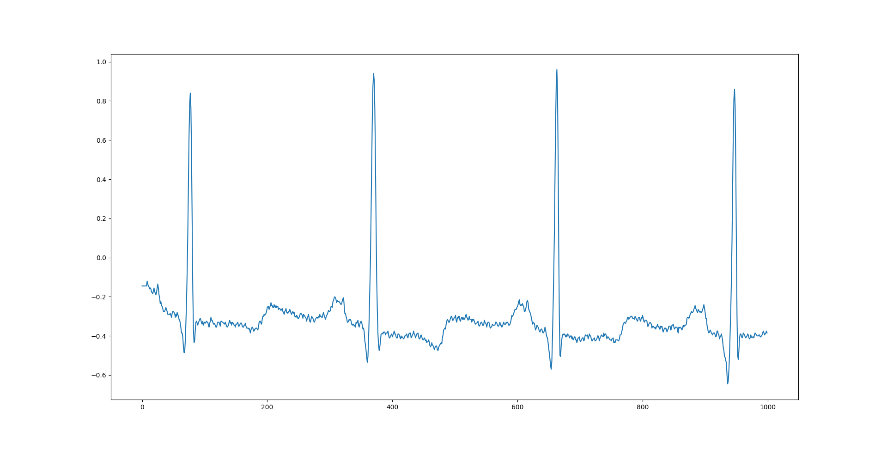

################################################################################
Tutorials
################################################################################

***************************************
Standard Data Access
***************************************

In this tutorial, we will walk you through the process of creating a dataset, inserting new data, and querying that
data using the atriumdb library. In this example we will pull data from the MIT-BIH Arrhythmia Database and store it in our dataset.

Prerequisites
-------------

- Python 3.10 or higher
- atriumdb library
- wfdb library
- matplotlib library
- tqdm library

You can install the required libraries using pip:

.. code-block:: bash

   pip install atriumdb wfdb tqdm matplotlib

Creating a New Dataset
----------------------

First, let's create a new dataset using the atriumdb library. We will use the default SQLite metadata database for simplicity.
The :ref:`create_dataset <create_dataset_label>` method asks you to specify:

- `dataset_location`: The local directory where the binary files will be written.
- `database_type`: What type of supporting database technology to use (sqlite is the default, mariadb, mysql).
- `connection_params`: If using mariadb or mysql, connection parameters described below used to connect to the database.

.. code-block:: python

   from atriumdb import AtriumSDK

   sdk = AtriumSDK.create_dataset(dataset_location="./new_dataset")

You can also create a dataset with a different metadata database, such as MariaDB or MySQL, by providing the
`database_type` and `connection_params` parameters. For example:

.. code-block:: python

   connection_params = {
       'host': "localhost",
       'user': "user",
       'password': "pass",
       'database': "new_dataset",
       'port': 3306
   }
   sdk = AtriumSDK.create_dataset(dataset_location="./new_dataset", database_type="mysql", connection_params=connection_params)

.. _inserting_data_into_the_dataset:

Inserting Data into the Dataset
--------------------------------

Now that we have created a new dataset, let's insert some data into it. Below, we read data
from the MIT-BIH Arrhythmia Database and store it in our dataset. In this example, we will create a separate device
for each record and handle multiple signals in a single record.

.. code-block:: python

    import wfdb
    from tqdm import tqdm
    import numpy as np

    # Get the list of record names from the MIT-BIH Arrhythmia Database
    pn_dir = 'mitdb'
    record_names = wfdb.get_record_list(pn_dir)

    # Loop through each record in the record_names list and read the record using the `rdrecord` function from the wfdb library
    for n in tqdm(record_names):
        # Pull record with digital values
        record = wfdb.rdrecord(n, pn_dir=pn_dir, return_res=64, physical=False)

        # For each record, create a new device in our dataset with the record name as the device tag
        # Check if a device with the given tag already exists using the `get_device_id` function
        # If it doesn't exist, create a new device using the `insert_device` function
        device_id = sdk.get_device_id(device_tag=record.record_name)
        if device_id is None:
            device_id = sdk.insert_device(device_tag=record.record_name)

        # Similarly we'll create a new patient_id for each record.
        patient_id = sdk.insert_patient()

        # Read The Record Annotations
        annotation = wfdb.rdann(n, 'atr', pn_dir="mitdb", summarize_labels=True, return_label_elements=['description'])
        label_time_idx_array = annotation.sample
        label_time_array = label_time_idx_array * (1 / record.fs)
        label_value_list = annotation.description

        # Define list of labels for the record
        labels = []

        # Create labels for each annotation.
        # NOTE the tuple order expected by insert_labels:
        #   (label_name, source_id, measure, label_source, start_time, end_time)
        # `source_id` is interpreted according to `source_type` (here, a device id).
        for i in range(len(label_value_list)):
            start_time = label_time_array[i]
            end_time = start_time + (1 / record.fs)  # Assuming an annotation lasts for one sample
            label_name = label_value_list[i]
            label_measure_id = None  # No specific signal associated with this label.
            label_source = 'WFDB Arrhythmia Annotation'  # Where the label came from
            labels.append((label_name, device_id, label_measure_id, label_source, start_time, end_time))

        # Insert labels into the database
        sdk.insert_labels(labels=labels, time_units='s', source_type='device_id')

        # The sampling frequency, expressed in nanohertz (1 Hz = 10^9 nHz).
        freq_nano = record.fs * 1_000_000_000

        # If there are multiple signals in one record, split them into separate dataset entries
        start_time_s = 0
        end_time_max = start_time_s
        if record.n_sig > 1:
            for i in range(len(record.sig_name)):

                # Check if a measure with the given tag and frequency already exists in the dataset using the `get_measure_id` function
                # If it doesn't exist, create a new measure using the `insert_measure` function
                measure_id = sdk.get_measure_id(measure_tag=record.sig_name[i], freq=freq_nano, units=record.units[i], freq_units="nHz")
                if measure_id is None:
                    measure_id = sdk.insert_measure(measure_tag=record.sig_name[i], freq=freq_nano, units=record.units[i], freq_units="nHz")

                # Calculate the digital to analog scale factors.
                gain = record.adc_gain[i]
                baseline = record.baseline[i]
                scale_m = 1 / gain
                scale_b = -baseline / gain

                # Write the data using the `write_segment` function
                sdk.write_segment(measure_id, device_id, record.d_signal.T[i], start_time_s, freq=record.fs,
                    scale_m=scale_m, scale_b=scale_b, time_units="s", freq_units="Hz")

                end_time_s = start_time_s + len(record.d_signal.T[i]) / record.fs
                end_time_max = max(end_time_max, end_time_s)

        # If there is only one signal in the input file, insert it in the same way as for multiple signals
        else:
            # Check if a measure with the given tag and frequency already exists in the dataset using the `get_measure_id` function
            # If it doesn't exist, create a new measure using the `insert_measure` function
            measure_id = sdk.get_measure_id(measure_tag=record.sig_name[0], freq=freq_nano, units=record.units[0], freq_units="nHz")
            if measure_id is None:
                measure_id = sdk.insert_measure(measure_tag=record.sig_name[0], freq=freq_nano, units=record.units[0], freq_units="nHz")

            # Calculate the digital to analog scale factors.
            gain = record.adc_gain[0]
            baseline = record.baseline[0]
            scale_m = 1 / gain
            scale_b = -baseline / gain

            # Write the data using the `write_segment` function
            sdk.write_segment(measure_id, device_id, record.d_signal.T[0], start_time_s, freq=record.fs,
                scale_m=scale_m, scale_b=scale_b, time_units="s", freq_units="Hz")

            end_time_s = start_time_s + len(record.d_signal.T[0]) / record.fs
            end_time_max = max(end_time_max, end_time_s)

        # Map the newly inserted device data to the newly create patient
        if end_time_max > start_time_s:
            sdk.insert_device_patient_data([(device_id, patient_id, start_time_s, end_time_max)], time_units='s')

.. note::

   **Keyword names matter.**
   `AtriumSDK.insert_measure <contents.html#atriumdb.AtriumSDK.insert_measure>`_ and
   `AtriumSDK.get_measure_id <contents.html#atriumdb.AtriumSDK.get_measure_id>`_
   take ``units=`` (plural). ``AtriumSDK.search_measures`` takes ``unit=`` (singular). Passing the
   wrong one raises ``TypeError: ... got an unexpected keyword argument``.

   A ready-to-run version of this whole walkthrough lives in
   ``sdk/docs/source/scripts/tutorial_script.py``.

.. _methods_of_inserting_data:

Methods of Inserting Data
--------------------------

There are multiple ways to insert data into AtriumDB, depending on the format and use case.

The two primary methods are: inserting **segments** and inserting **time-value pairs**, both with the option of using
**buffered inserts** to batch small pieces of data together.

Understanding these formats helps to select the best approach for your use case.

Segments
^^^^^^^^^^

Segments are `a sequence of evenly-timed samples <https://en.wikipedia.org/wiki/Sampling_(signal_processing)/>`_ .
A segment includes a **start time**, a **sampling frequency or period**, and a sequence of **values**.
The timestamp of each value can be inferred based on the start time and the frequency/period.

Segments are often used for high-frequency waveforms or signals.

**Timing Parameters**: You can specify timing using either:
- `freq` with `freq_units` (e.g., `freq=250, freq_units="Hz"`)
- `period` with `time_units` (e.g., `period=0.004, time_units="s"`)

**Note**: `freq` and `period` are mutually exclusive - specify one or the other, not both.

Segments can be inserted one at a time using `AtriumSDK.write_segment <contents.html#atriumdb.AtriumSDK.write_segment>`_
or in batches using `AtriumSDK.write_segments <contents.html#atriumdb.AtriumSDK.write_segments>`_.

Segments can also be batched piece by piece using :ref:`buffered_inserts`.

.. code-block:: python

    sdk = AtriumSDK.create_dataset(dataset_location, db_type, connection_params)
    measure_id = sdk.insert_measure(measure_tag="test_measure", freq=1.0, freq_units="Hz")
    device_id = sdk.insert_device(device_tag="test_device")

    # Inserting a single segment using frequency
    segment_values = np.arange(100)  # Continuous values from 0 to 99
    start_time = 0.0  # Start time in seconds
    sdk.write_segment(measure_id, device_id, segment_values, start_time, freq=1.0, time_units="s", freq_units="Hz")

    # Alternative: Inserting a single segment using period
    sdk.write_segment(measure_id, device_id, segment_values, start_time, period=1.0, time_units="s")

    # Inserting multiple segments at once using frequency
    segments = [np.arange(10), np.arange(10, 20), np.arange(20, 30)]
    start_times = [0.0, 10.0, 20.0]  # Start times in seconds for each segment
    sdk.write_segments(measure_id, device_id, segments, start_times, freq=1.0, time_units="s", freq_units="Hz")

    # Alternative: Inserting multiple segments using period
    sdk.write_segments(measure_id, device_id, segments, start_times, period=1.0, time_units="s")

Time-Value Pairs
^^^^^^^^^^^^^^^^^^

Time-value pairs allow you to insert irregularly sampled data, where each value has its own specific timestamp.
This format is common for low-frequency signals, such as metrics or aperiodic signals.

The method `AtriumSDK.write_time_value_pairs <contents.html#atriumdb.AtriumSDK.write_time_value_pairs>`_
can be used for inserting time-value pairs, with arrays of values and corresponding timestamps passed as arguments.

.. code-block:: python

    sdk = AtriumSDK.create_dataset(dataset_location, db_type, connection_params)
    measure_id = sdk.insert_measure(measure_tag="test_measure", freq=1.0, freq_units="Hz")
    device_id = sdk.insert_device(device_tag="test_device")

    # Inserting time-value pairs
    times = np.array([0.0, 2.0, 4.5])  # Time values in seconds
    values = np.array([100, 200, 300])  # Corresponding values
    sdk.write_time_value_pairs(measure_id, device_id, times, values, time_units="s")

    # Inserting time-value pairs with expected frequency
    sdk.write_time_value_pairs(measure_id, device_id, times, values, freq=0.5, time_units="s", freq_units="Hz")

    # Alternative: Inserting time-value pairs with expected period
    sdk.write_time_value_pairs(measure_id, device_id, times, values, period=2.0, time_units="s")

.. _aperiodic_measures:

Declaring an Aperiodic Measure
^^^^^^^^^^^^^^^^^^^^^^^^^^^^^^^

Irregular signals — NIBP every few minutes, a lab result, an alarm string, a ventilator mode —
have no fixed sampling rate. AtriumDB still requires a frequency on every measure, so the
question "what do I pass for ``freq``?" comes up immediately. The answers:

**You must pass a frequency (or a period).** ``insert_measure`` with neither raises
``ValueError: Either freq or period must be specified.``

**Do not pass** ``freq=0``. It is rejected, because the frequency is used as a divisor
(``period_ns = 10**18 // freq_nhz``)::

    ValueError: freq must be greater than 0; got 0. The frequency is used as a divisor
    (period_ns = 10**18 // freq_nhz), so 0 is not a usable value and a negative one makes
    every raster computation meaningless. Do NOT use freq=0 to mean 'aperiodic': give the
    measure a nominal frequency (e.g. freq=1, freq_units='Hz') and declare its temporal
    shape with signal_kind='sample' | 'event' | 'state', then write it with
    write_time_value_pairs().

**Give it a nominal frequency and declare** ``signal_kind``. The convention used throughout
these docs is ``freq=1.0, freq_units="Hz"`` plus an explicit ``signal_kind``:

.. code-block:: python

    nibp_id = sdk.insert_measure(measure_tag="NIBP_SYS", freq=1.0, freq_units="Hz",
                                 units="mmHg", signal_kind="sample", value_type="numeric")

.. warning::

    **The nominal frequency is part of the measure's identity.** ``get_measure_id``,
    the ``{"tag": ..., "freq_hz": ..., "units": ...}`` triplets in a
    :ref:`DatasetDefinition <definition_file_format>`, and the ``(tag, freq_hz, units)``
    key of ``window.signals`` all include it. Choosing ``1.0`` versus ``0.005`` produces two
    different measures, and every downstream lookup changes. Pick a convention (``1.0`` Hz is
    the one used here) and keep it — it cannot be changed after data is written.

    The nominal frequency does **not** affect the stored timestamps or what you read back.
    ``write_time_value_pairs`` stores your timestamps as given; declaring a measure at 1.0 Hz
    or at 0.005 Hz and writing the same irregular points reads back byte-identical.

**Pass** ``freq``/``period`` **on the write too, to silence period detection.** If
``write_time_value_pairs`` is given neither, it infers a period from the deltas in ``times``
and warns when no single delta accounts for more than 30% of the intervals::

    UserWarning: Automatic period detection: no single time delta accounts for >30% of
    intervals. Using best-effort estimate of 190.0 (mode of deltas, 1/7 intervals).
    For more accurate results, explicitly provide 'period' or 'freq'.

For genuinely irregular data there is no good period, so this fires on essentially every
write. The inferred period is **not** applied to your timestamps — those are stored exactly as
supplied — but it *is* used to size the gap tolerance behind the availability index, which is
why an aperiodic measure's
`interval array <contents.html#atriumdb.AtriumSDK.get_interval_array>`_ can extend past its
last observation by roughly one inferred period. Passing the measure's nominal
``freq``/``period`` on each write both silences the warning and makes the availability index
predictable:

.. code-block:: python

    times = np.array([0.0, 190.0, 480.0, 705.0, 1100.0, 1380.0, 1810.0, 2200.0])  # irregular
    values = np.array([118.0, 122.0, 115.0, 130.0, 127.0, 119.0, 124.0, 121.0])

    # Warns (period is guessed from the deltas):
    sdk.write_time_value_pairs(nibp_id, device_id, times, values, time_units="s")

    # Quiet, and the availability index is derived from the declared 1 Hz:
    sdk.write_time_value_pairs(nibp_id, device_id, times, values,
                               freq=1.0, freq_units="Hz", time_units="s")

.. _measure_metadata:

Measure Metadata: signal_kind and value_type
^^^^^^^^^^^^^^^^^^^^^^^^^^^^^^^^^^^^^^^^^^^^^^

Every measure carries two independent pieces of metadata describing the signal it holds:

- **``signal_kind``** — the *temporal shape* of the signal, one of ``waveform``, ``sample``,
  ``event`` or ``state``. ``waveform`` describes a regularly sampled continuous signal; ``sample``,
  ``event`` and ``state`` describe aperiodic signals.
- **``value_type``** — the *value encoding*, either ``numeric`` or ``string``.

These two axes are independent: a string signal can be an ``event``, a ``state`` or a ``sample``, and a
numeric signal can be any shape too.

Both are **optional** on
`AtriumSDK.insert_measure <contents.html#atriumdb.AtriumSDK.insert_measure>`_, but for anything that is
not a regularly sampled waveform you should always pass them. When you omit them,
read-time defaults apply: a measure with no stored ``signal_kind`` reads back as ``waveform``, and a
measure with no stored ``value_type`` defaults to ``numeric`` — unless string data is written to it, in
which case it resolves to ``string``. In other words ``value_type`` is inferred from the first write
(passing ``list[str]`` / string data establishes a ``string`` measure), while ``signal_kind`` is only
ever ``waveform`` unless you set it explicitly. Automatic shape inference beyond waveform is not
performed, so pass ``signal_kind`` yourself for aperiodic measures; ``sample`` is the safe default for
aperiodic numeric data.

.. warning::

    **Never create a string measure without** ``signal_kind``. Omitting it produces a
    ``waveform`` + ``string`` measure, which is not a meaningful combination: point reads with
    ``get_string_data`` appear to work, but the windowing iterator refuses to rasterize it::

        ValueError: Measure 4 is a string measure; its values cannot be NaN-filled.
        Use AtriumSDK.get_string_data(...) to read string data.

    Because the measure key (tag, frequency, units) is established by then and real data has
    been written against it, this is expensive to discover late. Every string measure should be
    declared ``signal_kind="event"``, ``"state"`` or ``"sample"``. If you inherit a measure in
    this state, repair it with
    `AtriumSDK.set_measure_kind <contents.html#atriumdb.AtriumSDK.set_measure_kind>`_ — no data
    is rewritten.

.. _choosing_signal_kind:

Choosing a ``signal_kind`` for a string measure
""""""""""""""""""""""""""""""""""""""""""""""""

This is the most consequential decision you make about a text channel, because
``signal_kind`` determines how the :ref:`windowing iterator <aperiodic_windowing>` rasterizes it
and therefore what a downstream researcher can ever get out of it:

.. list-table::
   :header-rows: 1
   :widths: 12 40 48

   * - ``signal_kind``
     - What a window contains
     - Use it for
   * - ``event``
     - ``float64`` **occupancy**: ``1.0``/``0.0`` presence per grid cell (or a count). It is
       *never* decodable back to strings — the only legal fill rules are ``presence`` and
       ``count``, and both discard the value's identity.
     - "did *something* happen in this cell" indicators, where you do not need to know *which*
       string fired. Read the actual text with ``get_string_data`` instead.
   * - ``state``
     - ``int64`` dictionary **codes**, one per grid cell, carried forward from the last observed
       transition and left-censored before it. Decodable with
       ``window.decode_string_signal``.
     - Anything that is "in effect until the next value": ventilator mode, alarm state,
       anesthesia START/STOP, an on/off condition you want as a per-cell channel.
   * - ``sample``
     - ``int64`` dictionary **codes**, one per grid cell (``carry_forward`` by default,
       ``sparse`` and ``aggregate:last`` also available). Decodable.
     - Discrete text readings that are point-in-time observations rather than a persisting
       state.

.. warning::

    **An** ``event`` **string measure can never yield decoded strings in a window.** A single
    alarm measure holding ``ASYSTOLE``, ``V-TACH`` and ``SENSOR_OFF`` collapses to one
    undifferentiated "something happened" channel; ``window.decode_string_signal`` on it raises
    ``ValueError: Cannot decode string codes ... the window's values have dtype float64``.
    If you need to know *which* value was in effect at each grid cell — for example to build a
    0/1 "in anesthesia" channel, or to feed alarm identity to a model — declare the measure
    ``signal_kind="state"`` (or ``"sample"``), not ``"event"``. Alarm and START/STOP channels
    generally want ``state``.

    ``signal_kind`` is normally set at ``insert_measure`` time. If you get it wrong,
    `AtriumSDK.set_measure_kind <contents.html#atriumdb.AtriumSDK.set_measure_kind>`_ can correct
    it afterwards — ``signal_kind`` is descriptive metadata and is safe to change at any time,
    including after data has been written::

        sdk.set_measure_kind(measure_id, signal_kind="state")   # ('state', 'string')

    ``value_type`` is **not** repairable in the same way: relabelling a measure that already
    holds string data as ``numeric`` (or vice versa) raises. See
    :ref:`Reading string windows <reading_string_windows>` for the full rasterization rules.

You can read the metadata back either as part of the full measure record via
`AtriumSDK.get_measure_info <contents.html#atriumdb.AtriumSDK.get_measure_info>`_, or as just the two
axes via `AtriumSDK.get_measure_kind <contents.html#atriumdb.AtriumSDK.get_measure_kind>`_.

.. code-block:: python

    # An alarm channel you only need occupancy for.
    alarm_id = sdk.insert_measure(
        measure_tag="alarm_text", freq=1.0, freq_units="Hz", units="alarm",
        signal_kind="event", value_type="string")

    # A ventilator mode: a state that persists until the next value, and that you want
    # to be able to decode per grid cell in a window.
    mode_id = sdk.insert_measure(
        measure_tag="vent_mode", freq=1.0, freq_units="Hz", units="mode",
        signal_kind="state", value_type="string")

    # Read the full record back; it includes signal_kind and value_type.
    info = sdk.get_measure_info(alarm_id)
    print(info['signal_kind'], info['value_type'])   # event string

    # Or fetch just the two axes as a tuple.
    signal_kind, value_type = sdk.get_measure_kind(mode_id)
    print(signal_kind, value_type)                   # state string

    # A measure created without the new fields defaults to waveform / numeric.
    numeric_id = sdk.insert_measure(measure_tag="heart_rate", freq=1.0, freq_units="Hz")
    print(sdk.get_measure_kind(numeric_id))          # ('waveform', 'numeric')

.. note::

    A measure is **either numeric or string** — never both. Once a measure's ``value_type`` is
    established (explicitly at ``insert_measure`` time, or by its first write), writing the other kind of
    value to it raises a ``ValueError``. Write the conflicting data to a separate measure instead.

.. note::

    There is no method to filter measures by ``signal_kind`` / ``value_type``
    (``AtriumSDK.search_measures`` matches on tag, frequency, unit and name only). Use a
    comprehension over
    `AtriumSDK.get_all_measures <contents.html#atriumdb.AtriumSDK.get_all_measures>`_::

        text_measures = [m for m in sdk.get_all_measures().values()
                         if m['value_type'] == 'string']

.. _string_values:

String Values
^^^^^^^^^^^^^^

AtriumDB can store dynamically-sized **string** values for a measure, alongside its numeric measures.
This is useful for aperiodic textual signals such as alarm messages, device status strings, or annotations.

You write strings with the **same methods used for numbers** -
`AtriumSDK.write_time_value_pairs <contents.html#atriumdb.AtriumSDK.write_time_value_pairs>`_ or
`AtriumSDK.write_data <contents.html#atriumdb.AtriumSDK.write_data>`_ -
simply by passing a ``list[str]`` (or a string/object numpy array) as the values. Under the hood, each
unique string is assigned an ``int64`` dictionary code and stored using the ordinary integer write path,
so no special block format is involved. The per-measure dictionary is an append-only JSON Lines file at
``<dataset_location>/meta/string_dict/measure_<measure_id>.jsonl``; existing codes are never rewritten, so
historical blocks stay valid as new strings are appended.

.. warning::

    The dictionary files under ``<dataset_location>/meta/string_dict/`` are **not recoverable
    from the block data**. Lose them and every waveform still reads perfectly while every string
    value becomes permanently undecodable. They must be backed up together with ``tsc/`` and the
    metadata database — see :ref:`Operations <operations>`.

To read string values back, use the dedicated
`AtriumSDK.get_string_data <contents.html#atriumdb.AtriumSDK.get_string_data>`_ method, which returns a
``(times, values)`` tuple where ``values`` is a 1D object numpy array of ``str``. It accepts the same
selectors (``measure_id`` or ``measure_tag``/``freq``/``units``, plus device/patient selectors) as
`AtriumSDK.get_data <contents.html#atriumdb.AtriumSDK.get_data>`_.

.. code-block:: python

    sdk = AtriumSDK.create_dataset(dataset_location, db_type, connection_params)

    # ALWAYS declare signal_kind on a string measure. 'state' is the right choice here:
    # an alarm is in effect until the next value, and 'state' is the only kind that can be
    # decoded back to strings inside a window. See "Choosing a signal_kind" above.
    measure_id = sdk.insert_measure(measure_tag="alarm_text", freq=1.0, freq_units="Hz",
                                    units="alarm", signal_kind="state", value_type="string")
    device_id = sdk.insert_device(device_tag="test_device")

    # Write strings with the ordinary write methods - just pass a list[str].
    times = np.array([0.0, 1.0, 2.0])  # seconds
    values = ["ASYSTOLE", "V-TACH", "ASYSTOLE"]  # dictionary-encoded automatically
    sdk.write_time_value_pairs(measure_id, device_id, times, values,
                               freq=1.0, freq_units="Hz", time_units="s")

    # The advanced AtriumSDK.write_data method accepts string/object value arrays too
    # (omit raw_value_type - the codes are stored as int64):
    from atriumdb import T_TYPE_TIMESTAMP_ARRAY_INT64_NANO
    ts_ns = np.array([10_000_000_000, 11_000_000_000, 12_000_000_000], dtype=np.int64)
    sdk.write_data(measure_id, device_id, ts_ns, values, freq_nhz=1_000_000_000,
                   time_0=int(ts_ns[0]), raw_time_type=T_TYPE_TIMESTAMP_ARRAY_INT64_NANO)

    # Read them back with get_string_data -> (times, values), values is a str object array.
    read_times, read_values = sdk.get_string_data(
        measure_id, start_time_n=0, end_time_n=10, device_id=device_id, time_units="s")
    print(read_values)  # array(['ASYSTOLE', 'V-TACH', 'ASYSTOLE'], dtype=object)

.. note::

    String measures cannot be analog-scaled or NaN-filled. Calling
    `AtriumSDK.get_data <contents.html#atriumdb.AtriumSDK.get_data>`_ on a string measure with the default
    ``analog=True``, or with ``return_nan_filled``, raises a ``ValueError`` pointing you to
    ``get_string_data``:

    .. code-block:: text

        ValueError: Measure 1 is a string measure; its values cannot be analog-scaled.
        Use AtriumSDK.get_string_data(...) to read string data.

    ``get_data(..., analog=False)`` on a string measure does **not** raise — it returns the raw
    ``int64`` dictionary codes with no decoding, which look like plausible small integers. Use
    ``get_string_data`` for point reads; it is the only read path that decodes.

    The windowing iterator *does* support string measures, and for ``state`` / ``sample`` kinds it
    carries the raw ``int64`` dictionary codes in each window (not decoded strings); see
    :ref:`aperiodic_windowing` for how to decode them. An ``event``-kind string measure is
    rasterized as numeric occupancy and cannot be decoded — see
    :ref:`Choosing a signal_kind <choosing_signal_kind>`.

.. _counting_events:

Counting event occurrences
""""""""""""""""""""""""""""

There is no aggregation helper — ``get_measure_string_vocabulary`` and
``get_string_values_present`` both return *distinct* values only. To count occurrences, read the
values and tally them:

.. code-block:: python

    from collections import Counter

    times, values = sdk.get_string_data(alarm_id, start_time_n=0, end_time_n=10 ** 18,
                                        device_id=device_id)
    counts = Counter(values.tolist())
    for value, n in counts.most_common():
        print(f"{value:<12} {n}")

.. _buffered_inserts:

Buffered Inserts
^^^^^^^^^^^^^^^^^^^^

Buffered inserts allow for efficient batch writing of data into the database.
When using the buffer, data is accumulated until a threshold is met (e.g., the number of values exceeds a specified maximum),
at which point the buffer is automatically flushed. The buffer can also be flushed manually and automatically upon exiting the buffer's context.
This method is optimal for live ingesting segments as they come from a device or back loading an archive of many small segments.

You can buffer both **segments** and **time-value pairs** using the `AtriumSDK.write_buffer <contents.html#atriumdb.AtriumSDK.write_buffer>`_ method.
The buffer organized data by their measure-device pair, and data is automatically written once the buffer fills or the context is closed.

.. code-block:: python

    sdk = AtriumSDK.create_dataset(dataset_location, db_type, connection_params)
    measure_id = sdk.insert_measure(measure_tag="test_measure", freq=1.0, freq_units="Hz")
    device_id = sdk.insert_device(device_tag="test_device")

    # Using write_buffer for batched writes
    reasonable_num_values_per_value = 100 * sdk.block.block_size  # 100 blocks
    with sdk.write_buffer(max_values_per_measure_device=reasonable_num_values_per_value,
                          max_total_values_buffered=10 * reasonable_num_values_per_value) as buffer:
        # Write multiple small segments to buffer
        for record in record_segments:
            sdk.write_segment(measure_id, device_id, record.d_signal, start_time_s, freq=record.fs,
                              scale_m=scale_m, scale_b=scale_b, time_units="s", freq_units="Hz")

            # Alternative: Write using period instead of frequency
            # period_s = 1.0 / record.fs
            # sdk.write_segment(measure_id, device_id, record.d_signal, start_time_s, period=period_s,
            #                   scale_m=scale_m, scale_b=scale_b, time_units="s")

        buffer.flush_all()
        # Buffer auto-flushes when the context is exited

Surveying Data in the Dataset
-----------------------------

In this section, we will discuss how to survey the data in our dataset, including retrieving information about all
measures and devices, and obtaining the availability of specified measures and sources.

Retrieving All Measures
^^^^^^^^^^^^^^^^^^^^^^^

To retrieve information about all measures in the dataset, you can use the :ref:`get_all_measures <get_all_measures_label>` method.
This method queries the linked relational database and returns a dictionary containing detailed information about each measure stored in the dataset.

The information includes:

- `id`: The unique identifier of the measure in the dataset.
- `tag`: A short, human-readable identifier for the measure.
- `name`: A more descriptive name for the measure (can be None if not defined).
- `freq_nhz`: The sample frequency of the measure in nanohertz (1 Hz = 10^9 nHz).
- `code`: A code (usually CF_CODE10) representing the measure (can be None if not defined).
- `unit`: The unit of the measure (e.g., 'BPM' for beats per minute).
- `unit_label`: A human-readable label for the unit (can be None if not defined).
- `unit_code`: A code (usually CF_CODE10) representing the unit (can be None if not defined).
- `period_ns`: The sampling period in nanoseconds, derived from ``freq_nhz`` (``10**18 // freq_nhz``).
- `source_id`: The identifier of the ingest source that registered the measure. It is ``None`` for
  measures created with `AtriumSDK.insert_measure <contents.html#atriumdb.AtriumSDK.insert_measure>`_ and is not a device or patient id.
- `signal_kind`: The temporal shape of the signal, one of ``waveform``, ``sample``, ``event`` or ``state`` (defaults to ``waveform``). See :ref:`Measure Metadata <measure_metadata>`.
- `value_type`: The value encoding of the signal, either ``numeric`` or ``string`` (defaults to ``numeric``). See :ref:`Measure Metadata <measure_metadata>`.

Here's an example of how to use the :ref:`get_all_measures <get_all_measures_label>` method:

.. code-block:: python

   # Instantiate the AtriumSDK object with the dataset location
   sdk = AtriumSDK(dataset_location="./example_dataset")

   # Retrieve information about all measures in the dataset
   all_measures = sdk.get_all_measures()

   # Print the retrieved information
   print(all_measures)

Example output:

.. code-block:: python

   {
       1: {
           'id': 1,
           'tag': 'MLII',
           'name': None,
           'freq_nhz': 360000000000,
           'period_ns': 2777777,
           'code': None,
           'unit': 'mV',
           'unit_label': None,
           'unit_code': None,
           'source_id': None,
           'signal_kind': 'waveform',
           'value_type': 'numeric'
       },
       2: {
           'id': 2,
           'tag': 'V5',
           'name': None,
           'freq_nhz': 360000000000,
           'period_ns': 2777777,
           'code': None,
           'unit': 'mV',
           'unit_label': None,
           'unit_code': None,
           'source_id': None,
           'signal_kind': 'waveform',
           'value_type': 'numeric'
       },
   }

In this example, the dataset contains two measures: ECG Lead MLII and ECG Lead V5,
both with a sample frequency of 360000000000 nanohertz (360 Hz) and units in millivolts (mV).
Both default to ``signal_kind='waveform'`` / ``value_type='numeric'`` because
`AtriumSDK.insert_measure <contents.html#atriumdb.AtriumSDK.insert_measure>`_ was called without them.

Retrieving All Devices
^^^^^^^^^^^^^^^^^^^^^^

To retrieve information about all devices in the dataset, you can use the :ref:`get_all_devices <get_all_devices_label>` method.
This method returns a dictionary containing information about each device in the dataset.

The information includes:

- `id`: The unique identifier of the device in the dataset.
- `tag`: A short, human-readable identifier for the device.
- `name`: A more descriptive name for the device (can be None if not defined).
- `manufacturer`: The manufacturer of the device (can be None if not defined).
- `model`: The model of the device (can be None if not defined).
- `type`: The type of the device (e.g., 'static', 'dynamic', 'monitor').
- `bed_id`: The identifier of the bed associated with the device (can be None if not defined).
- `source_id`: The identifier of the data source (e.g., device or patient) associated with the device.

Here's an example of how to use the :ref:`get_all_devices <get_all_devices_label>` method:

.. code-block:: python

   all_devices = sdk.get_all_devices()
   print(all_devices)

Example output:

.. code-block:: python

   {
       1: {
           'id': 1,
           'tag': '100',
           'name': None,
           'manufacturer': None,
           'model': None,
           'type': 'static',
           'bed_id': None,
           'source_id': 1
       },
       2: {
           'id': 2,
           'tag': '101',
           'name': None,
           'manufacturer': None,
           'model': None,
           'type': 'static',
           'bed_id': None,
           'source_id': 1
       },
       # ...
   }

In this example, the :ref:`get_all_devices <get_all_devices_label>` method returns a dictionary where the keys are the device ids and the values are
dictionaries containing the device properties. You can see that the output includes information about the
device's tag, name, manufacturer, model, type, bed_id, and source_id.

By examining the output, you can gain insights into the devices present in your dataset and their characteristics.
For example, you might notice that some devices have missing information (e.g., name, manufacturer, model),
which you could then decide to update or investigate further. Additionally, you can use the device ids to query your
dataset based on specific devices.

Getting Data Availability
^^^^^^^^^^^^^^^^^^^^^^^^^^
To obtain the availability of a specified measure (signal) and a specified source (device id or patient id),
you can use the :ref:`get_interval_array <get_interval_array_label>` method. This method provides information about the available data for a specific measure
and source by returning a 2D array representing the data availability.

Each row of the 2D array output represents a continuous interval of available data, with the first and second columns
representing the start epoch and end epoch of that interval, respectively.
This information can be useful when you want to analyze or visualize data within specific time periods or when you need to identify gaps in the data.

Here's an example of how to use the :ref:`get_interval_array <get_interval_array_label>` method:

.. code-block:: python

   # Define the measure_id and device_id for which you want to get data availability
   measure_id = 1
   device_id = 1

   # Call the get_interval_array method
   interval_arr = sdk.get_interval_array(measure_id=measure_id, device_id=device_id)

   # Print the resulting 2D array
   print(interval_arr)

Example output:

.. code-block:: python

   [[            0 1805555050000]]

In this example, the output shows that there is a single continuous interval of available data for the specified measure and device,
starting at epoch 0 and ending at epoch 1805555050000. This is because there are no gaps in the source mit-bih data.

.. note::

    **Coarse presence for aperiodic measures.** For ``waveform`` measures the interval array is a tight,
    near-exact map of where continuous data exists. For aperiodic ``signal_kind`` values (``sample``,
    ``event`` or ``state`` — see :ref:`Measure Metadata <measure_metadata>`), the interval index is a
    deliberately *coarse presence* map: it answers "are there readings roughly in this window", because
    the underlying writes use a widened gap tolerance so that irregular arrivals do not flood the index.
    For precise per-sample or per-event timing on those kinds, read the actual stored timestamps with
    :ref:`get_data <get_data_label>` / `get_string_data <contents.html#atriumdb.AtriumSDK.get_string_data>`_
    rather than relying on ``get_interval_array``. Pass ``gap_tolerance_nano`` to control how aggressively
    adjacent intervals are merged.

.. warning::

    **An aperiodic interval array can extend past the last observation.** The widening described
    above is derived from the measure's period, and when neither ``freq`` nor ``period`` was given
    at write time that period is *guessed* (see
    :ref:`Declaring an aperiodic measure <aperiodic_measures>`). An event measure whose last event
    is at t = 6600 s can therefore report availability out to t = 8400 s, past the end of the whole
    recording — which then leaks into anything built on that index, including
    :ref:`event-anchored regions <event_anchored_regions>`.

    Declaring the frequency on the write fixes it::

        # no freq declared          -> [[ 600000000000  8400000000000]]
        # freq=1.0 Hz declared      -> [[ 600000000000  6601000000000]]

    Always pass ``freq``/``period`` to ``write_time_value_pairs``, and pass an explicit
    ``end_time`` when validating a definition, if you care where availability ends.

These methods allow you to survey the data in your dataset and obtain information about the measures, devices, and data availability.
By understanding the data availability, you can make informed decisions about how to process, analyze, or visualize the data in your dataset.

Working with the Intervals Class
^^^^^^^^^^^^^^^^^^^^^^^^^^^^^^^^^

The :py:class:`~atriumdb.intervals.Intervals` class wraps the raw NumPy array returned by
:py:meth:`~atriumdb.AtriumSDK.get_interval_array` and provides set-like operations for comparing, combining,
and analysing time ranges.

**Creating an Intervals object from get_interval_array**

.. code-block:: python

   from atriumdb.intervals import Intervals

   # Retrieve the raw interval array for a measure / device pair
   interval_arr = sdk.get_interval_array(measure_id=1, device_id=1)

   # Wrap it in an Intervals object
   ecg_intervals = Intervals(interval_arr)

   print(ecg_intervals)
   # Intervals([[0, 1805555050000]])

   # Total duration covered (in nanoseconds)
   print(ecg_intervals.duration())

   # Number of continuous intervals
   print(len(ecg_intervals))

**Finding where two signals overlap**

A common task is determining the time ranges where two different signals are simultaneously available.
Use :py:meth:`~atriumdb.intervals.Intervals.intersection` (or the ``&`` operator) to compute this.

.. code-block:: python

   # Get availability for two different measures on the same device
   ecg_arr = sdk.get_interval_array(measure_id=ecg_measure_id, device_id=device_id)
   abp_arr = sdk.get_interval_array(measure_id=abp_measure_id, device_id=device_id)

   ecg_intervals = Intervals(ecg_arr)
   abp_intervals = Intervals(abp_arr)

   # Compute the overlap
   overlap = ecg_intervals & abp_intervals   # same as ecg_intervals.intersection(abp_intervals)

   print(f"Both signals are available for {overlap.duration() / 1e9:.1f} seconds")
   print(f"across {len(overlap)} continuous segment(s)")

**Finding gaps in a signal**

The :py:meth:`~atriumdb.intervals.Intervals.gaps` method returns the time ranges *between* consecutive
intervals, making it straightforward to inspect where data is missing.

.. code-block:: python

   ecg_intervals = Intervals(sdk.get_interval_array(measure_id=1, device_id=1))

   gap_intervals = ecg_intervals.gaps()
   if gap_intervals.is_empty():
       print("No gaps — the signal is fully continuous.")
   else:
       for start, end in gap_intervals:
           gap_sec = (end - start) / 1e9
           print(f"Gap from {start} to {end} ({gap_sec:.2f} s)")

**Combining availability from multiple devices**

If the same signal is recorded across several devices, you can merge all of the availability
windows into a single set with :py:meth:`~atriumdb.intervals.Intervals.union` (or the ``|`` operator).

.. code-block:: python

   device_ids = list(sdk.get_all_devices().keys())

   combined = Intervals([])
   for did in device_ids:
       arr = sdk.get_interval_array(measure_id=ecg_measure_id, device_id=did)
       if arr is not None and len(arr) > 0:
           combined = combined | Intervals(arr)

   print(f"ECG available for {combined.duration() / 1e9:.1f} seconds across all devices")

**Subtracting noisy regions**

If you have already identified noisy time ranges (for example, from labels), you can subtract
them from the available intervals with :py:meth:`~atriumdb.intervals.Intervals.difference`
(or the ``-`` operator).

.. code-block:: python

   # Suppose noise_intervals was built from label data
   noise_intervals = Intervals([[50_000_000_000, 70_000_000_000]])   # 50 s – 70 s

   clean = ecg_intervals - noise_intervals
   print(f"Clean signal covers {clean.duration() / 1e9:.1f} seconds")

**Checking whether a timestamp falls within the available data**

.. code-block:: python

   query_time = 1_000_000_000  # 1 second in nanoseconds

   if query_time in ecg_intervals:
       print("Data is available at this time.")
   else:
       print("No data at this time.")

**Iterating over intervals**

The :py:class:`~atriumdb.intervals.Intervals` object is iterable, so you can loop directly
over the ``(start, end)`` pairs.

.. code-block:: python

   for start, end in ecg_intervals:
       duration_s = (end - start) / 1e9
       print(f"Segment: {start} → {end}  ({duration_s:.2f} s)")

Querying Data from the Dataset
-------------------------------

Now that we have inserted and surveyed the data into our dataset, let's query the data and verify that the data has been correctly inserted.
We will iterate through the records in the MIT-BIH Arrhythmia Database and compare the data in our dataset to the original data.

.. code-block:: python

   # Iterate through the record names in the MIT-BIH Arrhythmia Database
   for n in tqdm(record_names):

       # Read the record from the MIT-BIH Arrhythmia Database
       record = wfdb.rdrecord(n, pn_dir="mitdb")
       # Calculate the sample frequency in nanohertz
       freq_nano = record.fs * 1_000_000_000

       # Get the device ID for the current record
       device_id = sdk.get_device_id(device_tag=record.record_name)

       # If there are multiple signals in the record, check both
       if record.n_sig > 1:
           for i in range(len(record.sig_name)):
               # Get the measure ID for the current signal
               measure_id = sdk.get_measure_id(measure_tag=record.sig_name[i], freq=freq_nano, units=record.units[i])

               # Query the data from the dataset
               _, read_times, read_values = sdk.get_data(measure_id, 0, 10 ** 18, device_id=device_id)

               # Check that the signal from MIT-BIH and AtriumDB are equal
               assert np.allclose(record.p_signal.T[i], read_values)

       # If there is only one signal in the record
       else:
           # Get the measure ID for the signal
           measure_id = sdk.get_measure_id(measure_tag=record.sig_name, freq=freq_nano, units=record.units)

           # Query the data from the dataset
           _, read_times, read_values = sdk.get_data(measure_id, 0, 10 ** 18, device_id=device_id)

           # Check that the signal from MIT-BIH and AtriumDB are equal
           assert np.allclose(record.p_signal.T[i], read_values)

.. _duplicate_timestamps_on_read:

Duplicate Timestamps on Read
-----------------------------

A dataset can legitimately hold **more than one sample at the same timestamp**. AtriumDB
deduplicates on write only as a side effect of the small-write block merge: a write smaller
than one optimal block merges into the closest existing block and collapses shared
timestamps, while a write of a full block or more is simply appended. Write speed is the
priority and the write path is not going to decode, merge and re-encode existing blocks to
guarantee otherwise, so a live feed that restarts and replays a large buffer stores both
copies.

Duplicates are therefore resolved on **read**, with ``allow_duplicates``:

.. code-block:: python

   # Default: every stored sample comes back, duplicates included.
   _, times, values = sdk.get_data(measure_id, start_ns, end_ns, device_id=device_id)

   # Collapsed: exactly one sample per timestamp.
   _, times, values = sdk.get_data(measure_id, start_ns, end_ns, device_id=device_id,
                                   allow_duplicates=False)

Semantics
^^^^^^^^^

- **A duplicate is two samples with the same timestamp.** It is decided on the timestamp
  alone — the same thing the write path's block merge means by it — whether or not the two
  copies carry the same value.
- **Exactly one sample per timestamp is returned**, and the result is sorted ascending by
  time.
- **Which copy survives follows the dataset's** ``overwrite`` **merge conflict policy**, so a
  read resolves a duplicate the same way a write would have if the two copies had met in one
  block:

  - ``"overwrite"`` / ``"ignore"`` (the default) — the **most recently written** copy wins.
  - ``"protect"`` — the **earliest written** copy wins.

  Pass ``duplicate_keep="last"`` or ``duplicate_keep="first"`` to override that for a single
  call.
- It applies when ``sort=True`` and ``time_type=1`` (the defaults) — collapsing requires
  ordering.
- The default is ``allow_duplicates=True``, i.e. **unchanged behaviour**. The collapse is
  vectorized (one stable sort and one mask, no per-sample loop), but it does cost that sort,
  so it is opt-in.

``get_string_data`` takes the same two parameters, with identical semantics. Duplicates are
collapsed on the stored dictionary codes before decoding, so the returned strings are always
the surviving samples' own text:

.. code-block:: python

   times, values = sdk.get_string_data(measure_id, start_ns, end_ns, device_id=device_id,
                                       allow_duplicates=False)

.. note::

   If you would rather such a write were refused outright than stored, create the dataset
   with ``overwrite="error"``: an overlapping write that cannot be deduplicated then raises
   instead of committing.

Retrieving Labels from the Dataset
------------------------------------------

We can also retrieve the annotations inserted as atriumdb labels earlier in the tutorial, first by recalling the different
label names inserted into the dataset:

.. code-block:: python

    label_name_dict = sdk.get_all_label_names()
    label_names = [label_info['name'] for label_id, label_info in label_name_dict.items()]

And then by calling `AtriumSDK.get_labels` to retrieve the label information:

.. code-block:: python

    for record_name in tqdm(record_names):
       # Read the record from the MIT-BIH Arrhythmia Database
       label_data = sdk.get_labels(name_list=label_names, device_list=[record_name])

.. _event_queries:

Event Queries
-------------------------------

A **string** (event) measure records aperiodic textual signals — alarm strings, device
status, or start/stop markers for a clinical state. On top of the raw
:ref:`string values <string_values>` you write, AtriumDB provides three standalone query
methods for inspecting the event vocabulary and for turning ``from → to`` event pairs into
state intervals. These are read-only query helpers; to build a
`DatasetDefinition <contents.html#atriumdb.DatasetDefinition>`_ *around* these events
(cohorts anchored on an event value, or spanning ``from → to`` pairs), see
:ref:`Event-Anchored Regions <event_anchored_regions>`.

Enumerating event values
^^^^^^^^^^^^^^^^^^^^^^^^^^

Two methods answer "what event strings exist?", at two different scopes:

- `AtriumSDK.get_measure_string_vocabulary <contents.html#atriumdb.AtriumSDK.get_measure_string_vocabulary>`_
  returns **every** string value ever written to a string measure, read cheaply from that
  measure's dictionary file — no data scan, so its cost is bounded by the vocabulary size
  rather than the number of samples.
- `AtriumSDK.get_string_values_present <contents.html#atriumdb.AtriumSDK.get_string_values_present>`_
  returns the sorted **distinct** string values actually present for a particular source
  (device or patient) over a time window — "which of those events actually occurred for
  device X last week".

Both raise a ``ValueError`` if you pass a numeric measure (events are string measures).

.. code-block:: python

    # A string/event measure holding START / STOP markers for a clinical state.
    measure_id = sdk.insert_measure(
        measure_tag="anesthesia_events", freq=1.0, freq_units="Hz",
        signal_kind="event", value_type="string")
    device_id = sdk.insert_device(device_tag="OR-1")

    # Every value ever written to the measure (cheap dictionary read, no data scan).
    print(sdk.get_measure_string_vocabulary(measure_id))   # e.g. ['START', 'STOP']

    # Only the distinct values a given source produced in a window.
    print(sdk.get_string_values_present(
        measure_id, start_time=0, end_time=120, device_id=device_id, time_units="s"))

Deriving event intervals
^^^^^^^^^^^^^^^^^^^^^^^^^^

`AtriumSDK.get_event_intervals <contents.html#atriumdb.AtriumSDK.get_event_intervals>`_
pairs a ``from_value`` event with the next ``to_value`` event in the **same** string
measure and returns the spans between them as a list of dicts::

    {"start_time_n", "end_time_n", "start_censored", "end_censored"}

The two time fields are **always in nanoseconds**, regardless of the ``time_units`` you use
for the input ``start_time``/``end_time``. Results are sorted by start time.

**Required arguments.** ``start_time`` and ``end_time`` are **mandatory** — they bound the
whole-stream container and define where censoring clips. Omitting either raises::

    ValueError: start_time and end_time are required for get_event_intervals --
    they bound the whole-stream container and define where censoring clips.

``measure`` must be a **measure id** (int); a tag raises
``ValueError: invalid literal for int() with base 10: '...'``. Resolve it with
``sdk.get_measure_id(...)`` first. (The ``measure`` key of an
:ref:`event-anchored region <event_anchored_regions>` *does* accept a tag.)

**Collapse pairing.** Pairing uses the *collapse* rule: a run of ``from`` events up to the
next ``to`` event is folded into ONE interval (first-open → first-close), and the returned
intervals never overlap. Repeated ``from`` events before a ``to`` do not create nested or
overlapping spans.

**The** ``within`` **cascade.** By default (``within=None``) each interval is scoped to a
container, resolved through a graceful cascade:
``device_patient`` (when a mapping is populated) → ``encounter`` → whole-stream (the query
range). You can force a specific level with ``within="device_patient"``, ``"encounter"``, or
``"none"`` (whole-stream). If the requested or needed scoping data is missing, the method
**warns and falls through** to the next level rather than silently dropping the query — and
the whole path runs even with an empty ``device_patient`` table. A pair that would span a
container boundary is clipped at the boundary; it never crosses it.

**Censoring.** The ``start_censored`` / ``end_censored`` flags mark intervals whose *true*
boundary lies outside the observed data — the boundary is clipped to the container/range and
**never fabricated**:

- A ``to`` event with no preceding ``from`` (e.g. recording began while the state was
  already on) → ``start_censored=True``, with ``start_time_n`` clipped to the container/range
  start.
- A ``from`` event with no following ``to`` (the state never closes within the data) →
  ``end_censored=True``, with ``end_time_n`` clipped to the container/range end.

.. note::

   **Quieting the scoping warning.** On a dataset with no ``device_patient`` mappings and no
   encounters — which is every dataset you build by following the quickstart — the default
   ``within=None`` cascade warns on every call::

       UserWarning: Neither device_patient nor encounter scoping data is available for this
       source; falling back to whole-stream scoping (the query range).

   Pass ``within="none"`` to ask for whole-stream scoping deliberately; the result is the same
   and the warning goes away.

.. warning::

   ``get_event_intervals`` pairs **two named marker values**. It is not a "time in each state"
   query and there is no wildcard: ``to_value=None`` / ``"*"`` / a list all raise.

   For a ``state`` measure whose value simply changes (``SIMV`` → ``PRVC`` → ``CPAP``),
   enumerating the other values and summing **double-counts badly**, because each ``SIMV`` run
   pairs with *every* later mode::

       SIMV -> PRVC: 50.0 min
       SIMV -> CPAP: 100.0 min
       SIMV -> PSV:  150.0 min
       naive sum   = 300.0 min      <-- wrong; the true answer is 50 min

   The correct approach for state occupancy is to read the raw transitions and diff consecutive
   timestamps:

   .. code-block:: python

       from collections import defaultdict

       times, values = sdk.get_string_data(mode_id, start_time_n=start_n, end_time_n=end_n,
                                           device_id=device_id)
       order = np.argsort(times)
       times, values = np.asarray(times)[order], np.asarray(values)[order]

       totals = defaultdict(float)
       for i in range(len(times) - 1):
           totals[values[i]] += (times[i + 1] - times[i]) / 1e9   # seconds

       # The LAST state is right-censored: its end is unknown within this range.
       print(dict(totals), "last state:", values[-1], "at", times[-1], "(right-censored)")

.. code-block:: python

    import numpy as np

    # Write START/STOP events. The recording begins mid-state: the first event is a
    # STOP at t=10 s with no preceding START, so the state was already "on".
    times = np.array([10.0, 30.0, 60.0, 90.0])      # seconds
    values = ["STOP", "START", "STOP", "START"]
    sdk.write_time_value_pairs(measure_id, device_id, times, values, time_units="s")

    intervals = sdk.get_event_intervals(
        measure=measure_id, from_value="START", to_value="STOP",
        device_id=device_id, start_time=0, end_time=120, time_units="s")

    for iv in intervals:
        print(iv)

    # Resulting intervals (times always in nanoseconds):
    #   {'start_time_n': 0,           'end_time_n': 10_000_000_000,
    #    'start_censored': True,  'end_censored': False}   # STOP with no prior START
    #   {'start_time_n': 30_000_000_000, 'end_time_n': 60_000_000_000,
    #    'start_censored': False, 'end_censored': False}   # a clean START -> STOP pair
    #   {'start_time_n': 90_000_000_000, 'end_time_n': 120_000_000_000,
    #    'start_censored': False, 'end_censored': True}    # START with no following STOP

Visualizing the Dataset
-------------------------------

Finally, let's retrieve data from our dataset and plot the first 1000 points of the first record's data.
We will use the `matplotlib` library to create a simple line plot of the data.

.. code-block:: python

    import matplotlib.pyplot as plt

    # Define the measure_id and device_id we want to retrieve data for
    measure_id = 1
    device_id = 1

    # Get the measure information for the specified measure_id
    measure_info = sdk.get_measure_info(measure_id=measure_id)
    device_info = sdk.get_device_info(device_id=device_id)

    # Extract the frequency in nanohertz from the measure information
    freq_nhz = measure_info['freq_nhz']

    # Calculate the period in nanoseconds by dividing 10^18 by the frequency in nanohertz
    period_nhz = int((10 ** 18) // freq_nhz)

    # Define the start and end time for the data we want to retrieve
    # We want to retrieve the first 1000 points, so we set the end time to 1001 times the period
    start_time_n, end_time_n = 0, 1001 * period_nhz  # [start, end)

    # Retrieve the data for the specified measure_id, device_id, start_time_n, and end_time_n
    _, times, values = sdk.get_data(measure_id=measure_id, device_id=device_id, start_time_n=start_time_n,
                                    end_time_n=end_time_n)

    # Plot the first 1000 points of the first patient's data using matplotlib
    plt.plot(times / (10 ** 9), values)  # convert x-axis units to seconds.
    plt.xlabel("Time (Seconds)")
    plt.ylabel("Signal Value")
    plt.title(f"First 1000 Points of Measure {measure_info['tag']} and Device {device_info['tag']}")
    plt.show()

************************************************
Reading Dataset With Iterators
************************************************

Working with large datasets often requires efficient access to smaller windows of data, particularly for tasks such
as data visualization, pre-processing, or model training. The AtriumSDK provides a convenient method, `get_iterator  <contents.html#atriumdb.AtriumSDK.get_iterator>`_,
to handle these cases effectively.

Creating a Dataset Definition
-----------------------------

The `DatasetDefinition <contents.html#atriumdb.DatasetDefinition>`_ object specifies the measures, patients and/or devices, and the time intervals we are interested in querying.
This definition can be provided in two different ways: by reading from a YAML file or by creating the object in your Python script.

**Option 1: Using a YAML file**

Suppose you have the following in your `definition.yaml  <dataset.html#definition-file-format>`_ file:

.. code-block:: yaml

    device_ids:
      1: all
      2: all

    measures:
      - MLII
      - tag: V1
        freq_hz: 360.0
        units: 'mV'

You can load this into a `DatasetDefinition <contents.html#atriumdb.DatasetDefinition>`_ object as follows:

.. code-block:: python

    from atriumdb import DatasetDefinition

    definition = DatasetDefinition(filename="definition.yaml")

**Option 2: Creating an object via Python script**

Alternatively, you can define your dataset programmatically:

.. code-block:: python

    from atriumdb import DatasetDefinition

    measures = ['MLII',
                {"tag": "V1", "freq_hz": 360.0, "units": "mV"},]
    device_ids = {
        1: 'all',
        2: 'all',
    }

    definition = DatasetDefinition(measures=measures, device_ids=device_ids)

If you wanted to create a dataset of all patients born after a certain date, you could setup your patient_ids dictionary like:

.. code-block:: python

    min_dob = 1572739200000000000  # Nanosecond epoch
    patient_ids = {patient_id: "all" for patient_id, patient_info in
        sdk.get_all_patients().items() if patient_info['dob'] and patient_info['dob'] > min_dob}

    definition = DatasetDefinition(measures=measures, patient_ids=patient_ids)

**Generating a DatasetDefinition for WFDB Example**

.. code-block:: python

    measures = [{"tag": measure_info['tag'],
                 "freq_nhz": measure_info['freq_nhz'],  # Can specify freq_nhz or freq_hz
                 "units": measure_info['unit']}
                for measure_info in sdk.get_all_measures().values()]
    device_ids = {device_id: 'all' for device_id in sdk.get_all_devices().keys()}
    definition = DatasetDefinition(measures=measures, device_ids=device_ids)

Iterating Over Windows
----------------------

Now that we've setup the `DatasetDefinition <contents.html#atriumdb.DatasetDefinition>`_ object, we can use it to iterate over our dataset.

.. code-block:: python

    window_size = 30
    slide_size = 30

    # Obtain the iterator
    iterator = sdk.get_iterator(definition, window_size, slide_size, time_units="s")

    # Now you can iterate over the data windows
    for window_i, window in enumerate(iterator):
        print(f"Window: {window_i}")
        print(f"Start Time: {window.start_time}")
        print(f"Device ID: {window.device_id}")
        print(f"Patient ID: {window.patient_id}")

        # Use window.signals to view available signals in their original form
        for (measure_tag, measure_freq_hz, measure_units), signal_dict in window.signals.items():
            print(f"Measure: {measure_tag}, Frequency: {measure_freq_hz} Hz, Units: {measure_units}")
            print(f"Times: {signal_dict['times']}")
            print(f"Values: {signal_dict['values']}")
            print(f"Expected Count: {signal_dict['expected_count']}")
            print(f"Actual Count: {signal_dict['actual_count']}")

************************************************
Dataset Definitions
************************************************

AtriumDB allows you to define and refine datasets using the `DatasetDefinition` object. This enables you to specify
which devices/patients, measures, labels, and time ranges should be included for analysis or modeling workflows.

Validating Dataset Definitions
------------------------------

Before a dataset definition can be used with other AtriumDB tools, it must be validated. Validation confirms that the
requested measures and labels exist in the database pointed at by the AtriumSDK object,
calculates the available time intervals, and prepares the dataset for iteration or partitioning.

You can validate a dataset definition like this:

.. code-block:: python

   definition.validate(
       sdk=sdk,
       gap_tolerance=5,  # Allow small gaps in availability (in seconds)
       start_time=1735845426,  # Optional: restrict time interval
       end_time=1737236445,
       time_units="s"
   )

Once validated, the definition is internally marked with `is_validated=True` so subsequent operations skip redundant validation steps.

.. _filtering_dataset_definitions:

Filtering Dataset Definitions
-----------------------------

Once validated, you may optionally filter the dataset to discard time windows that do not meet certain quality or availability requirements.

For example, to discard windows where less than 30% of the expected data is present:

.. code-block:: python

   def low_quality_filter(window):
       for signal_dict in window.signals.values():
           if signal_dict["expected_count"] == 0:
               return False
           if signal_dict["actual_count"] / signal_dict["expected_count"] < 0.3:
               return False
       return True

   definition.filter(
       sdk=sdk,
       filter_fn=low_quality_filter,
       window_duration=30,  # 30 second windows
       window_slide=30,
       time_units="s"
   )

.. note::

   To ensure that every window returned by the iterator has passed your filter function,
   the `window_duration` and `window_slide` used in `definition.filter()` should match exactly
   those used in `get_iterator()`. Using different values may result in the iterator producing
   windows that were not evaluated, or not accepted, by the filter.

.. warning::

   This ``actual_count / expected_count`` recipe **cannot reject an** ``event`` **channel.**
   Event cells are always "known" (absence is a meaningful ``0``), so an event measure always
   reports ``actual_count == expected_count`` — even in a window that contains no data at all.
   Adding an event measure to a definition therefore silently removes those windows from the
   filter's protection. Filter on the specific measures you care about instead::

       QUALITY_MEASURES = {ecg_id, nibp_id}   # ids from sdk.get_measure_id(...)

       def low_quality_filter(window):
           for signal_dict in window.signals.values():
               if signal_dict["measure_id"] not in QUALITY_MEASURES:
                   continue
               if signal_dict["expected_count"] == 0:
                   return False
               if signal_dict["actual_count"] / signal_dict["expected_count"] < 0.3:
                   return False
           return True

Saving Dataset Definitions
--------------------------

To preserve a dataset definition for reuse or inspection, save it to disk. Use the `.yaml` format for editable definitions,
or `.pkl` for fully validated objects with metadata.

.. code-block:: python

    definition.save("definition.yaml")               # Save raw, user defined definition
    definition.validate(sdk=sdk)
    definition.filter(
        sdk=sdk,
        filter_fn=low_quality_filter,
        window_duration=30,
        window_slide=30,
        time_units="s"
    )
    definition.save("filtered_definition.pkl")       # Save validated and optionally filtered version

Partitioning Dataset Definitions
--------------------------------

Once a dataset is validated and optionally filtered, it can be partitioned into multiple parts,
for example one for training, validation, and testing in an ML workflow.
To prevent data leakage, partition_dataset ensures that no single patient appears in more than one partition.

If there are specific labels you would like to balance across the partitions, put their names in priority_stratification_labels,
otherwise you can add all relevant labels to additional_labels so you can see how they've populated the resultant partitions.

.. code-block:: python

   from atriumdb import partition_dataset

   # Get all available label names from the dataset
   additional_labels = [
       label_info['name']
       for label_info in sdk.get_all_label_names().values()
   ]

   # Perform stratified patient-based partitioning
   train_def, val_def, test_def = partition_dataset(
       definition,
       sdk=sdk,
       partition_ratios=[60, 20, 20],  # train, val, test split
       priority_stratification_labels=[],  # no label balancing
       additional_labels=additional_labels,
       random_state=42,  # For reproducibility
       verbose=True      # Show label breakdown per split
   )

***************************************
Full Tutorial Script
***************************************

You can view or download the full Python script used in this tutorial here :download:`tutorial_script.py <scripts/tutorial_script.py>`.