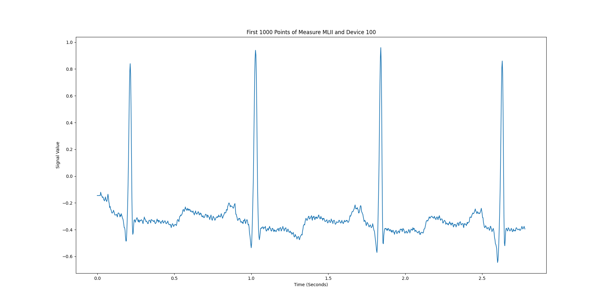

Creating a Dataset, Inserting Data, and Querying Data - A Comprehensive Tutorial
################################################################################

In this tutorial, we will walk you through the process of creating a dataset, inserting new data, and querying that data using the AtriumSDK library. We will use the provided example to read data from the MIT-BIH Arrhythmia Database and store it in our dataset.

Prerequisites
-------------

- Python 3.8 or higher
- AtriumSDK library
- wfdb library

You can install the required libraries using pip:

.. code-block:: bash

   pip install atriumdb wfdb

Creating a New Dataset
----------------------

First, let's create a new dataset using the AtriumSDK library. We will use the default SQLite metadata database for simplicity. The `create_dataset` method allows you to specify various options such as the type of metadata database to use, the protection mode, and the behavior when new data overlaps with existing data.

.. code-block:: python

   from atriumdb import AtriumSDK

   sdk = AtriumSDK.create_dataset(dataset_location="./new_dataset")

You can also create a dataset with a different metadata database, such as MariaDB or MySQL, by providing the `database_type` and `connection_params` parameters. For example:

.. code-block:: python

   connection_params = {
       'host': "localhost",
       'user': "user",
       'password': "pass",
       'database': "new_dataset",
       'port': 3306
   }
   sdk = AtriumSDK.create_dataset(dataset_location="./new_dataset", database_type="mysql", connection_params=connection_params)

Additionally, you can set the protection mode and overwrite behavior using the `protected_mode` and `overwrite` parameters. For example, to create a dataset with protection mode enabled and an overwrite behavior set to "error":

.. code-block:: python

   sdk = AtriumSDK.create_dataset(dataset_location="./new_dataset", protected_mode=True, overwrite="error")

These additional configurations allow you to customize the dataset according to your needs and preferences.

Inserting Data into the Dataset
--------------------------------

Now that we have created a new dataset, let's insert some data into it. We will use the provided example to read data from
the MIT-BIH Arrhythmia Database and store it in our dataset. In this example, we will create a separate device
for each record and handle multiple signals in a single record.

.. code-block:: python

   import wfdb
   from tqdm import tqdm

   record_names = wfdb.get_record_list('mitdb')

   for n in tqdm(record_names):

       record = wfdb.rdrecord(n, pn_dir="mitdb")

       # make a new device for each record and make the device tag the name of the record
       device_id = sdk.get_device_id(device_tag=record.record_name)
       if device_id is None:
           device_id = sdk.insert_device(device_tag=record.record_name)

       freq_nano = record.fs * 1_000_000_000

       time_arr = np.arange(record.sig_len, dtype=np.int64) * int(10 ** 9 // record.fs)

       # if there are multiple signals in one record split them into two different dataset entries
       if record.n_sig > 1:
           for i in range(len(record.sig_name)):

               # if the measure tag has already been entered into the DB find the associated measure ID
               measure_id = sdk.get_measure_id(measure_tag=record.sig_name[i], freq=freq_nano)
               if measure_id is None:
                   # if the measure, frequency pair is not in the DB create a new entry
                   measure_id = sdk.insert_measure(measure_tag=record.sig_name[i], freq=freq_nano)

               # write data
               sdk.write_data_easy(measure_id, device_id, time_arr, record.p_signal.T[i],
                                   freq_nano, scale_m=None, scale_b=None)

       # if there is only one signal in the input file insert it
       else:
           measure_id = sdk.get_measure_id(measure_tag=record.sig_name, freq=freq_nano)
           if measure_id is None:
               measure_id = sdk.insert_measure(measure_tag=record.sig_name, freq=freq_nano)

           sdk.write_data_easy(measure_id, device_id, time_arr, record.p_signal,
                               freq_nano, scale_m=None, scale_b=None)

Surveying Data in the Dataset
-----------------------------

In this section, we will discuss how to survey the data in our dataset, including retrieving information about all measures and devices, and obtaining the availability of specified measures and sources.

Retrieving All Measures
^^^^^^^^^^^^^^^^^^^^^^^

To retrieve information about all measures in the dataset, you can use the `get_all_measures` method. This method returns a dictionary containing information about each measure, including its id, tag, name, sample frequency (in nanohertz), code, unit, unit label, unit code, and source_id.

.. code-block:: python

   all_measures = sdk.get_all_measures()
   print(all_measures)

Example output:

.. code-block:: python

   {
       1: {
           'id': 1,
           'tag': 'MLII',
           'name': None,
           'freq_nhz': 360000000000,
           'code': None,
           'unit': '',
           'unit_label': None,
           'unit_code': None,
           'source_id': 1
       },
       2: {
           'id': 2,
           'tag': 'V5',
           'name': None,
           'freq_nhz': 360000000000,
           'code': None,
           'unit': '',
           'unit_label': None,
           'unit_code': None,
           'source_id': 1
       },
   }

Retrieving All Devices
^^^^^^^^^^^^^^^^^^^^^^

To retrieve information about all devices in the dataset, you can use the `get_all_devices` method. This method returns a dictionary containing information about each device, including its id, tag, name, manufacturer, model, type, bed_id, and source_id.

.. code-block:: python

   all_devices = sdk.get_all_devices()
   print(all_devices)

Example output:

.. code-block:: python

   {
       1: {
           'id': 1,
           'tag': '100',
           'name': None,
           'manufacturer': None,
           'model': None,
           'type': 'static',
           'bed_id': None,
           'source_id': 1
       },
       2: {
           'id': 2,
           'tag': '101',
           'name': None,
           'manufacturer': None,
           'model': None,
           'type': 'static',
           'bed_id': None,
           'source_id': 1
       },
       # ...
   }

Getting Data Availability
^^^^^^^^^^^^^^^^^^^^^^^^^^

To obtain the availability of a specified measure (signal) and a specified source (device id or patient id), you can use the `get_interval_array` method. This method returns a 2D array representing the availability of the specified measure and source. Each row of the 2D array output represents a continuous interval of available data while the first and second columns represent the start epoch and end epoch of that interval, respectively.

.. code-block:: python

   interval_arr = sdk.get_interval_array(measure_id=1, device_id=1)
   print(interval_arr)

Example output:

.. code-block:: python

   [[            0 1805555050000]]

These methods allow you to survey the data in your dataset and obtain information about the measures, devices, and data availability.

Querying Data from the Dataset
-------------------------------

Now that we have inserted data into our dataset, let's query the data and verify that the data has been correctly inserted.
We will iterate through the records in the MIT-BIH Arrhythmia Database and compare the data in our dataset to the original data.

.. code-block:: python

   for n in tqdm(record_names):

       record = wfdb.rdrecord(n, pn_dir="mitdb")
       freq_nano = record.fs * 1_000_000_000
       time_arr = np.arange(record.sig_len, dtype=np.int64) * ((10 ** 9) // record.fs)
       device_id = sdk.get_device_id(device_tag=record.record_name)

       # If there are multiple signals in the record check both
       if record.n_sig > 1:
           for i in range(len(record.sig_name)):
               measure_id = sdk.get_measure_id(measure_tag=record.sig_name[i], freq=freq_nano)

               _, read_times, read_values = sdk.get_data(measure_id, 0, 10 ** 18, device_id=device_id)

               # check that both the signal and time arrays from mitDB and atriumDB are equal
               assert np.array_equal(record.p_signal.T[i], read_values) and np.array_equal(time_arr, read_times)

       # If there is only one signal in the record
       else:
           measure_id = sdk.get_measure_id(measure_tag=record.sig_name, freq=freq_nano)

           _, read_times, read_values = sdk.get_data(measure_id, 0, 10 ** 18, device_id=device_id)

           assert np.array_equal(record.p_signal, read_values) and np.array_equal(time_arr, read_times)

Finally, let's retrieve data from our dataset and plot the first 1000 points of the first patient's data.

.. code-block:: python

   import matplotlib.pyplot as plt

   _, times, values = sdk.get_data(measure_id=1, device_id=1, start_time_n=0, end_time_n=(2**63)-1)
   # Plot the first 1000 points of the first patients data
   plt.plot(values[:1000])
   plt.show()

